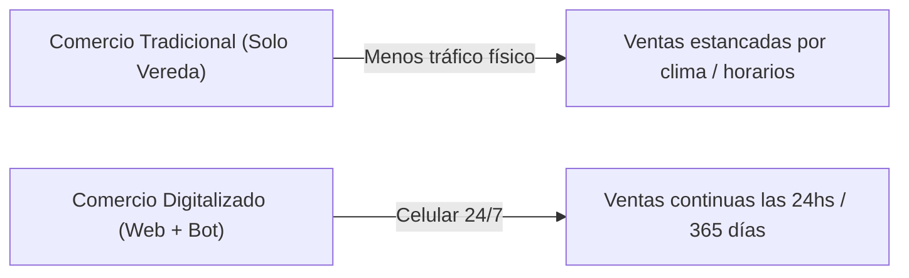

# 📈 Informe de Mercado & Propuesta de Valor: La Transformación Digital de tu Comercio

**Preparado por Naro AI — Agencia de Inteligencia Artificial & Desarrollo (Mar del Plata)**

---

## 📊 1. El Cambio Radical en los Hábitos de Compra (El Contexto Real)

El comercio tradicional ha cambiado para siempre. Hoy los hábitos de consumo en Mar del Plata y en toda Argentina muestran dos realidades innegables:

1. **La Explosión del E-Commerce y Mercado Libre**:
   - En Argentina, **más del 75% de las compras se inician o se investigan previamente desde un celular**.
   - Plataformas como Mercado Libre han educado al consumidor: la gente busca **inmediatez, ver fotos de calidad, conocer precios en el acto y pagar en 1 clic** desde el sillón de su casa o su trabajo.
   - Las ventas digitales han crecido más de un **300%** en los últimos 3 años.

2. **La Caída del Tráfico Físico en los Locales Tradicionales**:
   - Depender 100% de la gente que camina por la vereda expone a tu negocio a días de lluvia, frío, feriados y franjas muertas (de 13:00 a 17:00 hs o fuera del horario comercial).
   - **El cliente de hoy ya no camina horas buscando ropa, repuestos o turnos**: busca en Google o Instagram, compara desde el teléfono y le compra al comercio que le responde más rápido.

3. **La Solución**: Tu comercio físico no compite contra internet; **se expande gracias a internet**. Tu local sigue abierto de 9 a 20 hs, pero tu tienda digital y tu Bot de WhatsApp venden por vos las 24 horas del día.

---

## 🌐 2. ¿De qué le Sirve a tu Comercio cada Servicio que Ofrecemos? (Explicación Fácil y Directa)

---

### 🟢 A) Página Web Profesional + SEO Integrado
*(Tu Vidriera Digital ABIERTA las 24 Horas)*

- **¿Qué es el SEO explicado de manera simple?**
  Imaginá que Google es la avenida más concurrida de Mar del Plata (como la Peatonal San Martín o la Av. Güemes). El **SEO (Search Engine Optimization)** es asegurarte de que tu local esté ubicado en la **esquina más transitada de esa avenida**. 
  
  Todas nuestras páginas vienen con **SEO incluido por defecto**: esto significa que cuando un vecino de Mar del Plata busque en Google *"tienda de ropa en Mar del Plata"*, *"peluquería canina cerca mío"*, o *"uniformes escolares en Mar del Plata"*, tu comercio aparecerá **primeros en los resultados de búsqueda**, sin que tengas que gastar miles de pesos en publicidad todos los meses.

- **¿En qué beneficia a tu comercio?**:
  - Le da **credibilidad e imagen profesional** a tu marca.
  - Muestra todo tu catálogo o tus servicios con fotos claras y precios actualizados.
  - Atrae clientes nuevos de toda la ciudad que antes no conocían tu local.

---

### 🟣 B) Bot de WhatsApp con Inteligencia Artificial 24/7
*(Tu Empleado Estrella que NUNCA Duerme ni Pide Licencia)*

- **El Problema Real**: Cuando un cliente te escribe a las 10 de la noche o un domingo a la mañana preguntando precio o talle, si tardás 2 horas en contestar, **el cliente ya le compró a otro negocio que le respondió en el acto**.

- **¿De qué le sirve a tu comercio el Bot de IA de Naro AI?**:
  - **Respuesta Instantánea (en menos de 5 segundos)** las 24 horas del día, los 365 días del año.
  - Muestra el catálogo de productos o servicios con precios y disponibilidad de talles/colores.
  - **Toma de Señas y Pagos**: Envía el link de MercadoPago o CBU para cobrar la seña o el total del pedido automáticamente.
  - **Agendamiento Automatizado**: Si tenés un centro de estética, peluquería o consultorio, les permite a tus clientas elegir el día y horario disponible sin que vos tengas que tocar el teléfono.
  - Envía **recordatorios automáticos** por WhatsApp para eliminar los ausentismos en turnos.

---

### 🏬 C) Software de Gestión Comercial (Punto de Venta POS, Stock y Caja)
*(El Control Absoluto de tu Dinero y tu Mercado)*

- **¿De qué le sirve a tu comercio?**:
  - **Control de Stock en Tiempo Real**: Sabé exactamente qué talle, color o producto te queda en depósito o mostrador para no vender sin mercadería.
  - **Cuentas Corrientes y Fiados**: Registrá qué clientes te deben dinero, cuándo vence el pago y llevá el saldo al día sin libretas de papel.
  - **Actualización de Precios e Inflación**: Modificá precios masivamente por porcentaje en 1 solo clic.
  - **Cierre de Caja Diario Transparente**: Rendición exacta de cobros en efectivo, tarjeta, QR de MercadoPago y transferencias sin desfasajes de billetes.

---

## 📈 3. ¿Por qué Invertir en Naro AI Se Paga Solo en el Primer Mes?

Invertir en la transformación digital de tu comercio no es un "gasto", es una **inversión de alta rentabilidad**:

$$\text{Retorno de Inversión (ROI)} \implies \text{Recuperando solo 3 a 5 ventas semanales que hoy se pierden, el sistema se paga 100\% solo en 30 días.}$$

1. **Recuperás Ventas Perdidas**: El Bot de WhatsApp rescata a todas las personas que consultan de noche o los fines de semana cuando estás descansando.
2. **Ahorrás Horas de Trabajo Manual**: Dejás de responder la misma pregunta de *"¿cuánto cuesta?"* o *"¿dónde están ubicados?"* 50 veces al día.
3. **Elevás el Valor de tu Marca**: Un comercio con sitio web moderno y atención automatizada transmite la seguridad de una gran empresa.

---

## 📋 Cuadro Comparativo: Tu Comercio Hoy vs. Tu Comercio con Naro AI

| Dimensión | Comercio Tradicional (Sin Digitalizar) | Comercio Digitalizado con Naro AI |
| :--- | :--- | :--- |
| **Horario de Atención** | Solo cuando el local está abierto (8 hs/día) | **24 horas al día, los 365 días del año** |
| **Posicionamiento** | Depende de la gente que camina por la vereda | **Primero en Google Mar del Plata (SEO Incluido)** |
| **Atención por WhatsApp** | Manual, lenta, acumulando mensajes | **Respuestas en 5 segundos con Bot de IA** |
| **Control de Stock y Caja** | Anotado en papel, propenso a errores | **Sistema de Gestión Comercial en 1 clic** |
| **Cobro de Señas / Pedidos** | Esperar a que el cliente vaya al local | **Cobro Automático por MercadoPago en WhatsApp** |

---

**Naro AI — Agencia de Inteligencia Artificial & Desarrollo**  
*Impulsando el crecimiento comercial de Mar del Plata.*
